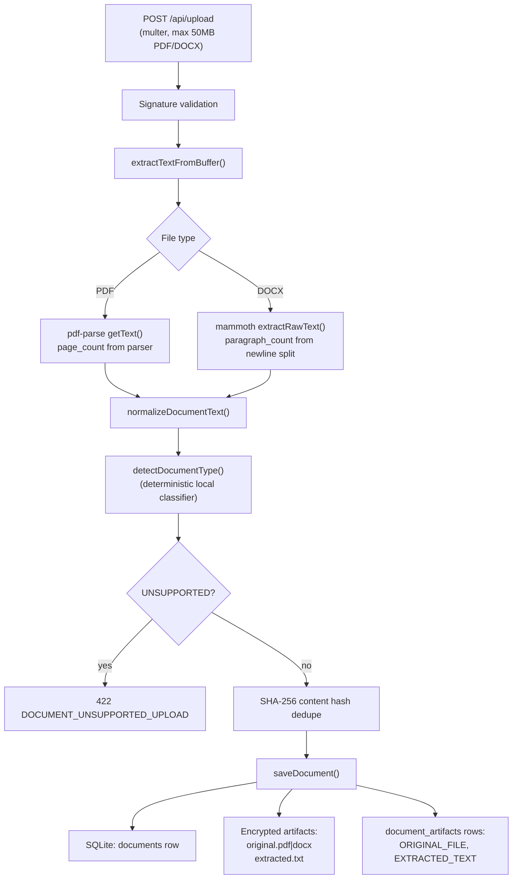
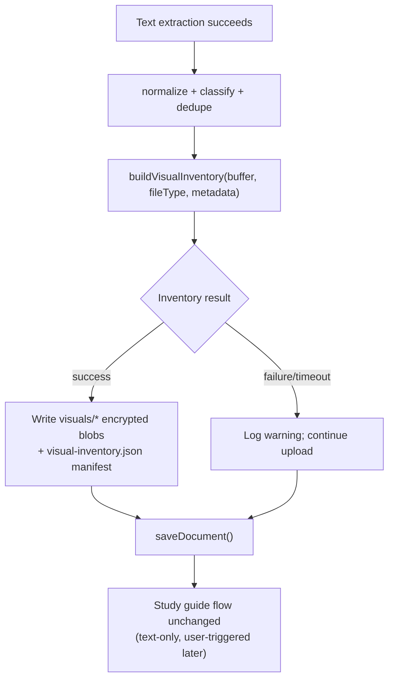

# Phase 2 — Visual Inventory Plan (Design Only)

**Status:** Planning document — no implementation in this branch  
**Branch:** `diptesh/phase2-visual-inventory-plan`  
**Scope:** Build a backend-only inventory of visual assets extracted from uploaded PDF/DOCX files, without OpenAI vision, without StudyGuide schema changes, and without Phase 1 UI changes.

---

## Executive Summary

Phase 2 adds a **deterministic, non-interpretive visual inventory** step to the upload pipeline. The system will extract and store embedded raster images as encrypted artifacts, indexed by a manifest file. Page rendering and vision interpretation are explicitly deferred. Nothing in Phase 2 sends images to OpenAI, changes StudyGuide JSON, changes citation shapes, or exposes new public API fields.

The recommended smallest safe implementation is:

> **Extract embedded raster images from PDF and DOCX during upload (best-effort, non-blocking), store them as encrypted files under the existing per-document artifact directory, and persist a single encrypted `visual-inventory.json` manifest referenced by one new `VISUAL_INVENTORY` row in `document_artifacts`.**

Defer full page rendering, DOCX paragraph association heuristics, public API delivery, and any LLM/vision usage to later phases.

---

## 1. Current Upload and Text Extraction Flow

Today’s pipeline (see `docs/SYSTEM_ARCHITECTURE.md`, `backend/src/routes/contract.ts`, `backend/src/services/textExtractor.ts`):



**Key properties relevant to Phase 2:**

| Property | Current behavior |
|----------|------------------|
| Upload sync scope | Text extraction + classification + persist only |
| Visual handling | None — diagrams, charts, and embedded figures are ignored |
| Study guide trigger | Separate user action (`POST /api/study-guide/create`) |
| LLM inputs | Extracted text only (`doc.extractedText`) |
| Artifact storage | AES-256-GCM encrypted files on disk (`ARTIFACTS_DIR/{documentId}/`) |
| Artifact index | SQLite `document_artifacts` with `UNIQUE(document_id, artifact_type)` |
| Deletion | Removes registered artifact paths + `fs.rmSync` entire document directory |
| Retention | 30-day document lifecycle (see `docs/DB_SCHEMA.md`) |

**Dependencies already in repo:**

- PDF text: `pdf-parse` (transitively includes `@napi-rs/canvas`, but canvas is not used for rendering today)
- DOCX text: `mammoth` (raw text only; no image extraction configured)
- Encryption: `backend/src/lib/encryption.ts` (`writeEncryptedBuffer`, `writeEncryptedText`)

---

## 2. Where Visual Inventory Fits in the Pipeline

Visual inventory should run **during upload**, immediately after successful text extraction and **before or alongside** `saveDocument()`, as a **best-effort sidecar** that never blocks a valid text upload.



**Placement rationale:**

| Option | Verdict |
|--------|---------|
| During upload (recommended) | Assets available before study-guide generation; no API contract change; aligns with “inventory at ingest” |
| During study-guide generation | Couples visuals to LLM job latency/failures; harder to retry independently |
| Lazy on first UI request | Requires new API endpoints (out of Phase 2 scope) |

**Non-blocking rule:** If visual inventory fails (timeout, corrupt image, unsupported PDF feature), upload still succeeds when text extraction passes. Inventory status is logged internally; no user-facing error in Phase 2.

---

## 3. PDF Options

### 3A. Render pages as images

Render each PDF page (or selected pages) to PNG/WebP via `pdfjs-dist` + `@napi-rs/canvas`, Poppler (`pdftoppm`), or similar.

| Pros | Cons |
|------|------|
| Captures vector diagrams, charts, and text rendered as graphics | Very large storage (every page × DPI) |
| Natural alignment with existing PDF citations (`page` is already 1-indexed) | High CPU/memory on Railway single replica |
| Works when images are not embedded as XObject streams | Redundant with text extraction for text-heavy slides |
| Future UI can show “page N” thumbnails without new anchor model | Scanned PDFs may produce huge multi-page bitmaps |

**Cost/storage example (rough):** 30-page lecture at 150 DPI ≈ 30 × ~200–500 KB WebP ≈ 6–15 MB per document, before encryption overhead.

### 3B. Extract embedded images

Parse PDF structure and export inline `/Image` XObjects (JPEG, PNG, JPX, etc.).

| Pros | Cons |
|------|------|
| Smaller storage — only actual figure blobs | Misses vector-only diagrams (common in CS/math PDFs) |
| Faster than full page render | Page association may require additional parser metadata |
| No interpretation — byte-preserving extraction | Duplicate/near-duplicate icons and logos may clutter inventory |
| Lower Railway CPU load | Some slides are one big flattened image (still large, but one file) |

**Libraries to evaluate later:** `pdf-lib`, `pdfjs-dist` image operator walk, or dedicated extractors. No new dependency decision required for this plan doc.

### 3C. PDF recommendation for Phase 2

**Start with 3B (embedded image extraction only).** Add optional, capped page renders in Phase 3+ for lecture slides where embedded-image yield is zero.

Phase 2 caps (implementation detail for later):

- Max images per document (e.g. 50)
- Max decoded pixels per image (e.g. 4096×4096)
- Max total visual inventory bytes per document (e.g. 25 MB)
- Skip images below minimum dimensions (e.g. 32×32) to filter icons/bullets

---

## 4. DOCX Options

### 4A. Extract embedded images from the DOCX package

DOCX is a ZIP archive. Embedded media typically lives under `word/media/*`.

| Pros | Cons |
|------|------|
| Straightforward unzip + file copy | No paragraph context without parsing `document.xml` |
| Faithful to source bytes (PNG, JPEG, EMF, WMF) | EMF/WMF may need conversion for web display (defer conversion in Phase 2; store as-is) |
| Low CPU relative to rendering | Floating/anchored images have ambiguous paragraph ownership |
| `mammoth` ecosystem familiarity | Image order in ZIP ≠ reading order |

### 4B. Associate images with nearby paragraphs

Parse OOXML (`word/document.xml`, relationships) to map each `w:drawing` / `wp:inline` to a paragraph index compatible with existing DOCX citations (`paragraph` 1-indexed, same counting as `textExtractor.ts` newline split **or** a dedicated paragraph walker — these may diverge and must be documented).

| Pros | Cons |
|------|------|
| Aligns inventory with citation model for future “figure near paragraph 14” UI | OOXML is complex; heuristics can be wrong |
| Enables later grounding without vision | Phase 1 paragraph_count is a simple newline split — may not match OOXML paragraph indices |
| Better lecture figure navigation | Requires explicit paragraph-index algorithm shared with validation (future phase) |

### 4C. DOCX recommendation for Phase 2

**Start with 4A (extract `word/media/*` rasters).** Record `anchor.paragraph: null` and `anchor.media_path` in the manifest. Treat 4B as Phase 3 once a canonical paragraph-index function is defined and tested against citation validation.

---

## 5. Proposed Artifact Model for Visual Assets

Phase 2 introduces an **internal manifest** stored as encrypted JSON. It is **not** part of StudyGuide, Quiz, or public API responses.

### 5.1 On-disk layout (under existing artifact directory)

```
{ARTIFACTS_DIR}/{document_id}/
  original.pdf | original.docx      # existing
  extracted.txt                     # existing
  visual-inventory.json             # NEW — encrypted JSON manifest
  visuals/
    {asset_id}.png                  # NEW — encrypted binary per asset
    {asset_id}.jpg
    ...
```

### 5.2 Manifest shape (internal contract — not `docs/SCHEMAS.md`)

```json
{
  "version": 1,
  "document_id": "uuid",
  "file_type": "PDF | DOCX",
  "created_at": "ISO-8601",
  "extraction": {
    "status": "ready | partial | failed | skipped",
    "duration_ms": 1234,
    "error_code": null,
    "error_message": null
  },
  "assets": [
    {
      "id": "uuid",
      "kind": "embedded_image",
      "mime_type": "image/png",
      "sha256": "hex",
      "byte_size": 102400,
      "width_px": 800,
      "height_px": 600,
      "encrypted_path": "visuals/{asset_id}.png",
      "anchor": {
        "source_type": "pdf",
        "page": 3
      }
    },
    {
      "id": "uuid",
      "kind": "embedded_image",
      "mime_type": "image/jpeg",
      "sha256": "hex",
      "byte_size": 204800,
      "width_px": 1200,
      "height_px": 900,
      "encrypted_path": "visuals/{asset_id}.jpg",
      "anchor": {
        "source_type": "docx",
        "paragraph": null,
        "media_path": "word/media/image1.png"
      }
    }
  ],
  "limits_applied": {
    "max_assets": 50,
    "max_total_bytes": 26214400,
    "min_dimension_px": 32
  }
}
```

**Design rules:**

- `kind` is enumerated; Phase 2 allows only `embedded_image`. Reserve `page_render` for Phase 3+.
- `anchor` records **location pointers only** — no captions, labels, or semantic descriptions (no interpretation). PDF `page` may be `null` when the extractor cannot determine it.
- `sha256` is of **plaintext image bytes before encryption** (aids dedupe/idempotency within a document).
- No LLM-generated fields anywhere in this manifest.

---

## 6. Storage: Existing Encrypted Artifacts vs New DB Metadata

### 6.1 Encrypted artifact storage (reuse)

**Yes — reuse existing patterns:**

- Write blobs with `writeEncryptedBuffer()` (`backend/src/lib/encryption.ts`)
- Store under `{ARTIFACTS_DIR}/{document_id}/`
- Rely on `cleanupDocumentDirectory()` for deletion even if individual image paths are not registered in SQLite

### 6.2 SQLite / `document_artifacts` (minimal extension)

Current schema (`backend/src/db/sqlite.ts`, `docs/DB_SCHEMA.md`):

- `artifact_type IN ('ORIGINAL_FILE', 'EXTRACTED_TEXT')`
- **`UNIQUE(document_id, artifact_type)`** — one row per type per document

Phase 2 needs **one additional artifact type** for discoverability:

| Field | Phase 2 value |
|-------|----------------|
| `artifact_type` | `VISUAL_INVENTORY` |
| `encrypted_path` | path to `visual-inventory.json` |
| `content_hash` | SHA-256 of manifest JSON (plaintext, pre-encryption) |

Individual image files **do not require separate DB rows** if their paths are listed in the manifest and the document directory is wiped on delete.

**Alternative considered:** Store manifest only on disk without a DB row. Rejected because upload/retry flows and retention jobs currently discover artifacts via `document_artifacts`; a DB row makes inventory auditable and testable.

### 6.3 DB migration required?

**Yes — a small, justified migration:**

1. Extend `document_artifacts.artifact_type` CHECK constraint to include `VISUAL_INVENTORY`.
2. No new tables required for Phase 2 smallest path.
3. No changes to `study_guides`, `documents` columns, or StudyGuide JSON.

**Not required in Phase 2:**

- Per-asset DB table (defer unless query patterns need indexing across documents)
- API response fields on `GET /api/documents/:id`
- Citation schema extensions

---

## 7. Privacy and Storage Implications

| Topic | Implication |
|-------|-------------|
| **Encryption** | Visual blobs and manifest must use the same AES-256-GCM envelope as `original.*` and `extracted.txt` |
| **Privacy policy** | Update `frontend/src/app/privacy/page.tsx` in a later phase when visuals are user-visible; Phase 2 is backend-only but still stores additional derived bytes from user uploads |
| **Scope** | Same user ownership and auth gates as existing documents |
| **Retention** | Visual files inherit 30-day document retention and user-initiated deletion |
| **Volume growth** | Railway persistent volume is the bottleneck; embedded-image caps are mandatory |
| **Sensitive content** | Photos, ID badges, scanned homework pages may appear in embedded images even when text extraction omits them — treat visuals as equally sensitive as original uploads |
| **Logging** | Log counts and byte sizes only; never log image bytes or base64 in production logs |

---

## 8. Cost Implications (Why Phase 2 Avoids OpenAI Vision)

| Cost type | Phase 2 (inventory only) | If vision were added (out of scope) |
|-----------|--------------------------|-------------------------------------|
| OpenAI API | **$0** — no image tokens | Per-image/per-page charges; hard to cap on large PDFs |
| Railway CPU | One-time upload CPU for parse/unzip | Vision preprocessing + larger payloads |
| Railway storage | +manifest +images (cap-controlled) | Often +duplicate thumbnails and interpreted metadata |
| Latency | Adds bounded upload time (target: ≤15s sidecar with timeout) | Multi-minute jobs for large decks |
| Failure blast radius | Non-blocking sidecar | Could fail or delay study-guide generation |

**Why avoid vision in Phase 2:**

1. **Academic integrity** — vision models may infer answers from homework diagrams; Phase 2 must not interpret content.
2. **Grounding contract** — StudyGuide validation is text-substring based (`docs/VALIDATION.md`); vision output has no validation path yet.
3. **Determinism** — inventory is byte extraction; vision introduces hallucinated captions and labels.
4. **Cost predictability** — upload already runs synchronously; vision would tie billing to document complexity.

OpenAI text generation costs for study guides/quizzes remain unchanged in Phase 2.

---

## 9. Academic-Integrity Risks and Lecture-First Strategy

Phase 2 inventory alone does **not** change LLM prompts or StudyGuide output. Risks are **forward-looking** for Phase 3+ UI/integration:

| Risk | Mitigation |
|------|------------|
| Homework figure shows solution diagram | Do not display visual inventory in homework UI until gating rules exist; lecture-first rollout |
| Future LLM vision on homework | Explicitly prohibited until integrity review; out of scope |
| Inventory implies “answer assets” | Manifest stores location only; no descriptions |
| Page thumbnails include worked examples | Cap/defer page renders; lecture-only feature flag later |
| Enlarged diagrams in quiz/study UI | Quiz remains text-verbatim (`docs/AI_contract.md`); visuals are supplementary, not generative |

**Why lecture-first visual support is safer later:**

- Lecture slides: figures reinforce concepts; low answer-leak risk
- Homework: figures often contain problems, rubrics, or worked templates — high leak risk if shown adjacent to “Problem Guide” sections
- Phase 2 builds infrastructure without exposing homework surfaces

**Phase 2 constraint:** No changes to `backend/src/services/guardrails.ts`, `outputValidator.ts` rules, or `docs/AI_contract.md`.

---

## 10. Testing Plan

### 10.1 Unit tests (new)

| Test | Intent |
|------|--------|
| PDF with embedded PNG/JPEG | Extracts ≥1 asset, correct MIME, dimensions > 0 |
| PDF with no embedded images | Manifest `assets: []`, status `ready` |
| DOCX with `word/media/image1.png` | Extracts media files |
| DOCX with no media | Empty inventory |
| Oversized / too many images | Limits applied; status `partial` |
| Corrupt/truncated image inside valid PDF | Skip asset; do not fail whole upload |
| Timeout | Sidecar aborts; upload still succeeds |

Fixtures: small synthetic PDF/DOCX files committed under `backend/src/tests/fixtures/visual/` (keep <100 KB each).

### 10.2 Store / integration tests

| Test | Intent |
|------|--------|
| Upload end-to-end | `document_artifacts` contains `VISUAL_INVENTORY` when extraction succeeds |
| `deleteDocumentById` | Entire `{document_id}/` directory removed including `visuals/` |
| Duplicate upload reuse | Existing document path reuses prior inventory (no duplicate work) or idempotent rewrite — pick one behavior and test |
| Encryption round-trip | Manifest and image decrypt to expected bytes |

Extend patterns in `backend/src/tests/storeCrud.test.ts`, `routeStateTransitions.test.ts`.

### 10.3 Non-regression

| Test | Intent |
|------|--------|
| Study guide generation | Unchanged — still text-only |
| Text-only PDF upload | Still succeeds when visual inventory fails |
| Output validator suite | No changes expected in Phase 2 |

### 10.4 Manual QA (post-implementation)

- Upload lecture PDF with diagrams → verify artifact directory contents on disk (dev)
- Upload homework DOCX with embedded figure → verify manifest asset count
- Confirm Phase 1 Study Brief UI unchanged (`frontend/src/app/(app)/documents/[id]/page.tsx` untouched)

---

## 11. Files Likely to Change During Future Implementation

### Backend (primary)

| File | Change |
|------|--------|
| `backend/src/services/visualInventory.ts` | **NEW** — extraction orchestration, caps, manifest builder |
| `backend/src/services/pdfVisualExtractor.ts` | **NEW** — embedded PDF image extraction |
| `backend/src/services/docxVisualExtractor.ts` | **NEW** — DOCX media extraction |
| `backend/src/services/textExtractor.ts` | Optional: export shared timeout helper only (minimal touch) |
| `backend/src/routes/contract.ts` | Call visual inventory in `uploadDocumentHandler` (non-blocking) |
| `backend/src/store/memoryStore.ts` | Write `VISUAL_INVENTORY` artifact; helper to persist manifest + blobs |
| `backend/src/db/sqlite.ts` | Extend `artifact_type` CHECK |
| `backend/package.json` | Add extraction dependency (e.g. `jszip` for DOCX; PDF library TBD) |

### Backend tests

| File | Change |
|------|--------|
| `backend/src/tests/visualInventory.test.ts` | **NEW** |
| `backend/src/tests/storeCrud.test.ts` | Artifact type coverage |
| `backend/src/tests/routeStateTransitions.test.ts` | Upload + inventory integration |
| `backend/src/tests/fixtures/visual/*` | **NEW** tiny PDF/DOCX fixtures |

### Docs (implementation phase)

| File | Change |
|------|--------|
| `docs/DB_SCHEMA.md` | Document `VISUAL_INVENTORY` artifact type |
| `docs/SCHEMA.md` | Mirror DB change |
| `docs/SYSTEM_ARCHITECTURE.md` | Add visual inventory box to upload flow |
| `frontend/docs/DB_SCHEMA.md`, `frontend/docs/SCHEMA.md` | Mirror updates |

### Explicitly out of scope (Phase 2)

| File | Reason |
|------|--------|
| `frontend/src/app/(app)/documents/[id]/page.tsx` | User constraint — no Phase 1 UI changes |
| `docs/SCHEMAS.md` | No StudyGuide schema changes |
| `frontend/src/lib/contracts.ts` | No API contract changes |
| `backend/src/services/contentAnalyzer.ts` | No LLM / vision inputs |
| `backend/src/services/outputValidator.ts` | No citation model changes |

---

## 12. Recommended Smallest Safe Implementation (Phase 2)

### Step-by-step

1. **Add `visualInventory.ts` service** with strict timeouts (e.g. 15s) and byte/asset caps.
2. **PDF:** Extract embedded raster images only; record `page` when parser provides it, else `null`.
3. **DOCX:** Unzip and copy `word/media/*` raster entries (png, jpg, jpeg, gif, webp); skip emf/wmf initially or store without conversion.
4. **Persist:** Encrypt each asset to `visuals/{uuid}.ext`; write encrypted `visual-inventory.json`; upsert single `VISUAL_INVENTORY` artifact row.
5. **Upload hook:** Invoke after text extraction succeeds; catch all errors; never fail upload solely for inventory failure.
6. **Migration:** Extend `artifact_type` enum/check for `VISUAL_INVENTORY`.
7. **Tests:** Unit + store CRUD + upload route test with fixtures.
8. **Docs:** Update DB schema mirrors and architecture diagram.

### Explicit deferrals (Phase 3+)

- Public `GET` endpoint to serve images to frontend
- StudyGuide / citation linkage to `asset_id`
- Page rendering for vector-heavy PDFs
- DOCX paragraph ↔ image association
- OpenAI vision or caption generation
- UI gallery in Study Brief / Sections tabs
- EMF/WMF → PNG conversion pipeline

### Success criteria for Phase 2

- [ ] Upload still succeeds for all current acceptance tests when visual extraction fails
- [ ] At least one test PDF and one test DOCX produce a non-empty manifest in CI
- [ ] Manifest and blobs are encrypted at rest
- [ ] Document deletion removes visual files
- [ ] No OpenAI vision calls; no StudyGuide JSON changes; no public API changes
- [ ] Phase 1 frontend files untouched

---

## Appendix A — API Endpoints (Phase 2)

**No new public endpoints in Phase 2.**

A future Phase 3 will likely need authenticated image delivery (e.g. `GET /api/documents/:id/visuals/:assetId`) — that requires explicit API design, caching headers, and auth review. Document here as **future**, not Phase 2.

---

## Appendix B — Open Questions for Implementation Kickoff

1. **Duplicate upload:** Re-run inventory or reuse existing manifest when `reused_existing: true`?
2. **PDF library choice:** Prefer pure-JS (`pdfjs-dist`) vs native bindings for Railway portability?
3. **Paragraph index canonicalization:** When should DOCX paragraph counting diverge from newline split used today?
4. **Partial inventory status:** Should `partial` affect any user-visible upload metadata, or remain internal-only?

---

*End of Phase 2 Visual Inventory Plan*
