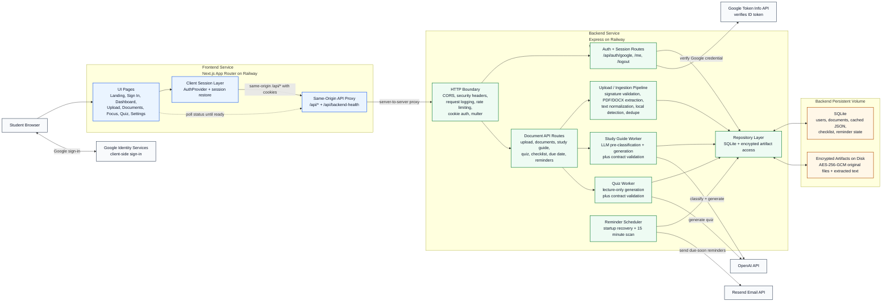
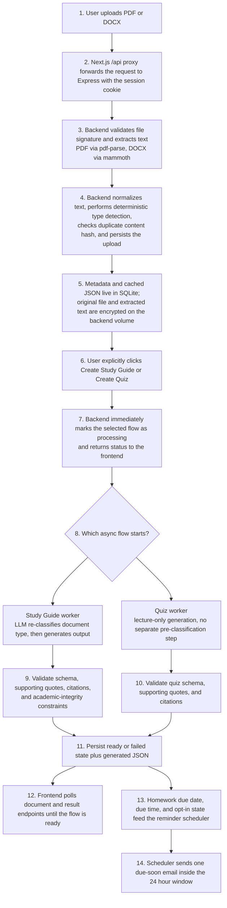

# LearnEase System Architecture

This diagram reflects the current implementation in this repository: a Next.js frontend, an Express backend, local encrypted artifact storage, SQLite metadata/cached outputs, Google-based authentication, OpenAI-backed processing, and an in-process reminder scheduler.

## Corrected V2 Topology

## Processing Lifecycle

## Architecture Notes

- The browser talks to the frontend origin only. The Next.js API layer proxies backend calls so session cookies remain first-party.
- The backend is intentionally stateful. SQLite, encrypted local artifacts, crash recovery, and reminder scheduling all assume one replica with a persistent volume.
- Upload is synchronous only through extraction and initial classification. Study-guide and quiz generation are asynchronous in-process jobs with persisted status for polling.
- Study-guide generation uses a two-stage classification model: deterministic local detection at upload time, then LLM classification before generation. Quiz generation does not use that extra pre-classification step.
- Google token verification is part of the auth route only. It is not a generic call made by all backend requests.
- AI output is never trusted directly. The backend validates schema shape, citation grounding, verbatim quote presence, and academic-integrity rules before saving results.
- The persistent boundary is split by data type: SQLite stores metadata and cached JSON; encrypted disk artifacts store the original upload and extracted text on the backend volume.

## Read This With The Diagram

- [docs/API.md](/Users/diptesh/Projects/senior-design-LearnEase/docs/API.md)
- [docs/AUTH.md](/Users/diptesh/Projects/senior-design-LearnEase/docs/AUTH.md)
- [docs/DB_SCHEMA.md](/Users/diptesh/Projects/senior-design-LearnEase/docs/DB_SCHEMA.md)
- [docs/DEPLOY_RAILWAY.md](/Users/diptesh/Projects/senior-design-LearnEase/docs/DEPLOY_RAILWAY.md)
